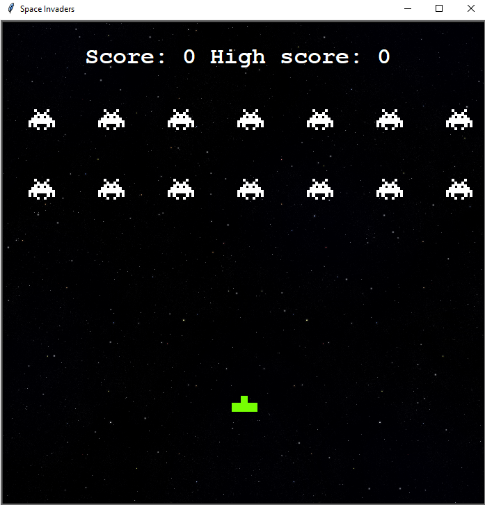

# Space Invaders (Python Implementation)

# Description
- 14 enemies, against one player
- You can only fire if, your bullet has reached the top of the screen
- If you die your score will go back to 0, but your high-score will be kept. (Loses after closing the game)
- There are infinite amount of waves
- The enemies are shooting randomly

